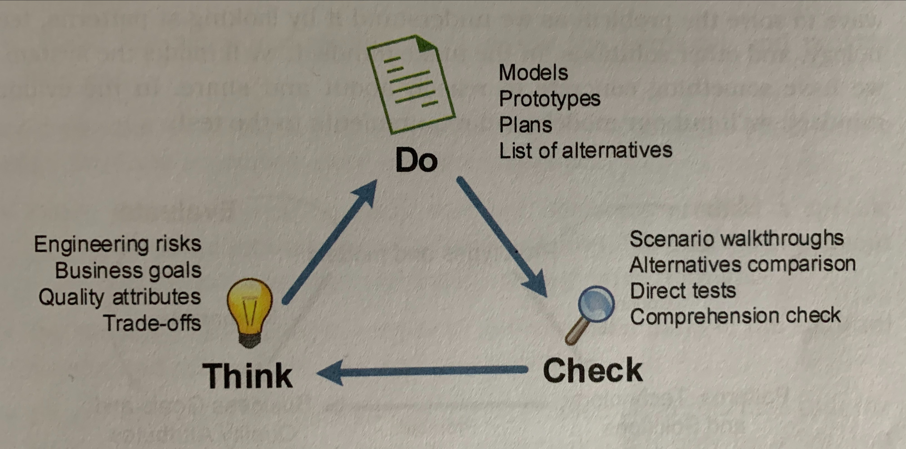
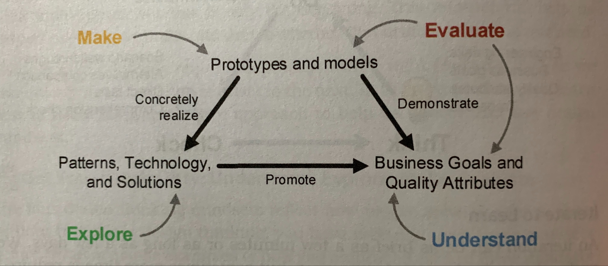

# Chapter 2 - Design Thinking Fundamentals
Designing software architecture requires exploring solutions while simultaneously uncovering the problem to be solved.
To help with this, utilize design thinking.

> __Design thinking__ is a problem solving approach placing humans at the center of attention.

Focusing on the people affected by the design decisions helps us concentrate on the exact problems that must be solved.
It also grounds the solution exploration by elevating the purpose of building software that helps people.

## The Four Principles of Design Thinking
1. Human Rule: all design is social in nature
2. Ambiguity Rule: presever ambiguity
3. Redesign Rule: all design is redesign
4. Tangibility Rule: make ideas tangible to facilitate communication

Let us relate these 4 design principles to software architecture design to learn how to apply design thinking in the context of software architecture.

### Design for Humans
We design _for_ people.

We design _with_ people.

Every design decision in the architecture helps people in some way.
Empathize with all stakeholders, regardless of whether their interaction with the architecture is direct or indirect.

### Preserve Ambiguity
Ambiguity in engineering is dangerous, but it can be used to keep options open.
Therefore, design a __minimalist architecture__, which is an architecture only _showing how_ high-priority quality attributes are achieved and reduces risks for promoting those quality attributes.
All other design decisions are left open for downstream designers to determine outside the architecture.

In other words, defer binding design decisions for as long as responsible.

### Design is Redesign
Think about what you already know by exploring patterns and past designs.

Ask others.

When designing software architectures, we spend more time refining existing designs than creating new ones.

### Make the Architecture Tangible
To share architecture with others, make it real in a way code by itself will not allow.

The tangibility rule is closely related to the Human Rule.
Humans must be able to relate to ideas to internalize them.

## Adopt a Design Mindset
> A __design mindset__ is a way of thinking to focus our attention on the right details at the right time.

There are 4 design mindsets: understand, explore, make, and evaluate.

To design the architecture:
- choose a mindset
- pick a practice from that mindset
- apply the practice to learn something new about the architecture
- repeat

### Understand the Problem
In the _understand mindset_, we actively seek info from stakeholders and work to describe the problem.
This mindset is as much about requirements as it is empathy.

### Explore Ideas
In the _explore mindset_, we create multiple design concepts and identify engineering approaches for solving some aspect of a problem.
This mindset is also useful when working with stakeholders.

### Make it Real
In the _make mindset_, we turn design concepts into real-world artifacts (ties closely to the Tangibility Rule design principle).
Making is an excellent way to move out of analysis paralysis.

### Evaluate Fit
In the _evaluate mindset_, we determine the fitness of our design decisions relative to our current understanding;
in other words, does the design decision solve the problem?

## Think, Do, Check
While working on a software system, we learn about it.
Every new thing we learn might force the architecture to evolve to reconcile the new information.
Thus, we need a design approach with a tight feeedback loop giving us the opportunity to change our design mindesets often.

Think, do, and check is an iterative approach where each cycle focuses on a particular mindset.

### Iterate to Learn
Every iteration follows the same steps, though execution varies depending on the design mindset.
- Think: create a plan to learn what is needed to answer specific questions or reduce risks
- Do: execute the plan; create something tangible that quickly and cheaply uncovers info needed to check our thinking and share our ideas
- Check: critically examine the outcomes/outputs of the _do_ step to decide the next move

### Adopt Mindsets in any Order
Each design mindset is a tool.
Embrace the mindset currently required, order does not matter.
Design mindsets shift frequently and quickly; for example, mindsets might shift often during a single conversation.

Awareness of the 4 design mindsets provide new techniques for getting out of a rut.
If you get stuck, choose a new mindset.
