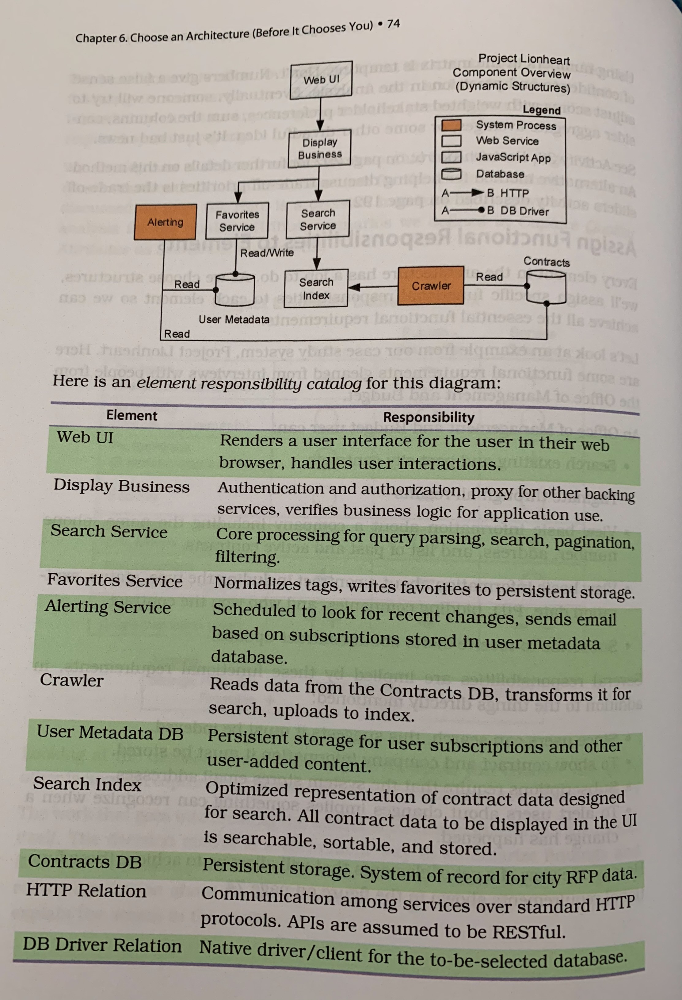
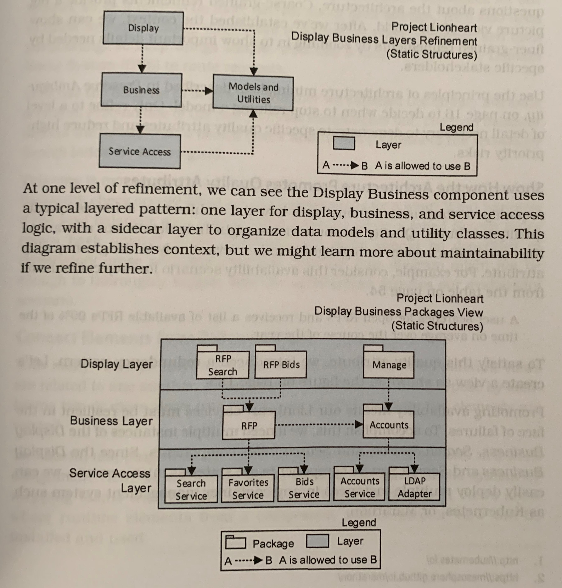

# Chapter 10 - [Make] Visualize Design Decisions
The best way to share an idea is to make it tangible.

This chapter teaches how to draw architecture diagrams to share ideas effectively.

## Show the Architecture from Different Views
> A __view__ is a story about the architecture told from the perspective of a particular stakeholder or set of related concerns.
A view could be a diagram, a table, or anything else communicating design decisions.

Rather than squeezing every detail into a single diagram, create multiple views of the architecture.
Each view helps stakeholders answer questions about the system.

Let's explore some of the views useful for most software systems.

### Tell Us What Elements Do with an Element-Responsibility View
This view includes a diagram of the relationships between elements and an element-responsibility catalog describing each element's specific purpose.

### Zoom In or Out with a Refinement View
_Refinement_ is the process of increasing detail in a model over a series of views.
For example, zooming in on a structure to show the element's inner workings.

Remember, each refinement is to help specific stakeholders answer specific questions.
Use the principles of architecture minimalism described in _Preserve Ambiguity_ to decide when to stop refining a model.

### Show How the Architecture Promotes Quality Attributes
A _quality attribute view_ demonstrates how the architecture achieves specific quality attributes.
Only highlight details relevant to the given quality attribute.
These views might spark many questions, so one might include explanatory prose accompanying the diagram.

### Connect Elements from Different Views
A _mapping view_ combines two or more views into a new view showing how the elements are related.
Some examples are work assignment, deployment, and a mapping between architectural components and value-adding features.

### Let Ideas Breathe with a Cartoon
Sometimes we need a fast-to-create, imprecise model favoring communication over analysis/precision.
An example of such a view is an architecture cartoon.
Use views such as these for rapid iteration, informal communication, and capturing the essence of an idea.
Once design decisions start to converge, then create a more precise model.

### Create Custom Views to Show Exactly What You Need
Any view of the architecture helping you effectively tell a story about the system to stakeholders is a view worth having.
Remember, all views, even custom views, are governed by a meta-model as discussed in _Design the Meta-Model_.

## Draw Fantastic Diagrams
| Do this | Avoid this |
| --- | --- |
| create a legend summarizing parts of the meta-model relevant to this diagram | assume your readers know your notations |
| add a descriptive title and tell what kinds of structures are in the diagram | try to include everything in a single diagram |
| add text annotations to enhance clarity | use notations that lose meaning when printed in black and white |
| use a consistent notation across all diagrams | go overboard with superfluous flourishes or an excessive variety of shapes and lines |
| make the patterns visible | skip descriptive prose |

 
Diagrams are a vehicle for communicating design decisions and context.
Chapter 11 teaches how to provide the stories that accompany views.