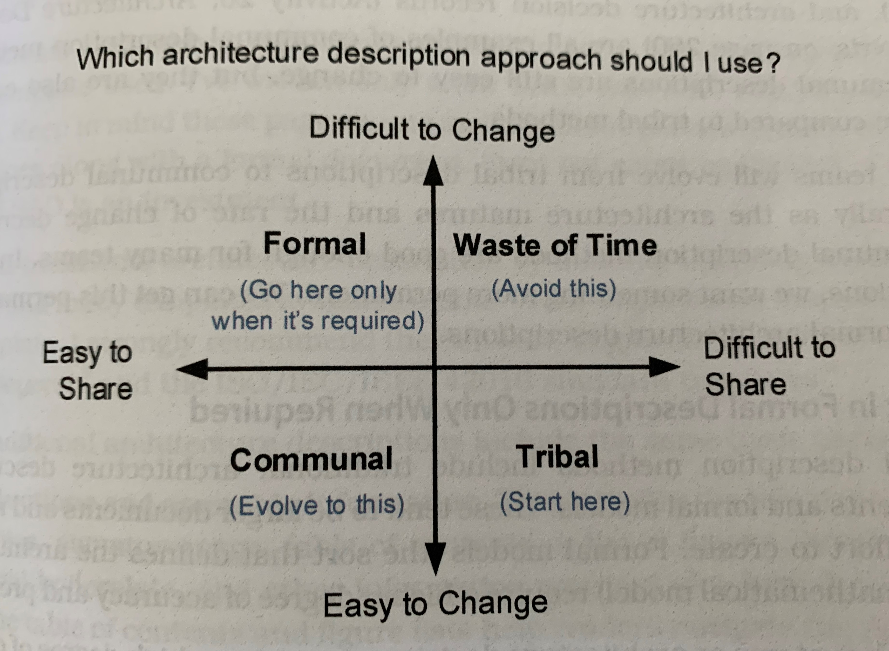

# Chapter 11 - [Make] Describe the Architecture
Great architecture descriptions give a team clarity.
Great architecture descriptions are a planning asset, a communication aide, and a collaboration tool.
They improve the quality of the software by helping our design decisions reach everyone.

Let's learn to create software architecture descriptions that people _love_.

## Tell the Whole Story
Architecture descriptions are needed for several reasons:
- organization: they show how everything comes together
- establish the language between technical and business stakeholders: while models establish the vocabulary of design, the architecture description translates those models into ideas different stakeholders can understand.
An important job of an architecture description is to show how the business goals and quality attributes are addressed in the architectural design decisions.
- put a spotlight on quality attributes: the architecture treats quality attributes as first-class citizens; keep quality attributes at the front of everyone's mind by making the architecture something to see, read about, and talk about
- clarify thinking: writing an architecture description forces us to confront our knowledge and come to terms with what we know, think we know, and do not know
- create something you can evaluate: architecture descriptions enable analyzing design decisions while it is easy to make changes and without waiting for every design decision to be realized in code
- show it off

## Match the Description Method to the Situation
There are two questions to answer to decide how to document our architecture:
1. How likely are our design decisions to change?
2. How far must we share the design decisions?

The answers lead to one of four types of description methods: tribal, communal, formal, or wasteful.

### Create an Oral History with Tribal Methods
Tribal description methods rely heavily on oral tradition and cultural artifacts.
Easy to change; perfect for the rapid design churn young architectures face.

Always start here.
Difficult to share; a sign to evolve to communal is exhaustion of constantly telling stories.

Examples: story telling, metaphors, and informal sketching

### Reach Further with Communal Methods
When telling the same story to more than a few people, it is time to evolve the style of architecture description from tribal to communal in order to increase reach.

Most teams evolve to this naturally as the architecture matures and the rate of change decreases.
Communal description methods are good enough for many teams.

### Invest in Formal Descriptions Only When Required
Evolve from communal to formal only if required.
Formal models require a higher degree of accuracy and precision, and thus more effort.

High-risk systems or architecture decisions requiring a high degree of coordination are good candidates for formal description methods.

### Avoid Wasting Time
The best way to avoid wasting time is by creating great architecture descriptions.
All great descriptions, no matter the method used, have 4 traits:
- custom built with the audience in mind
- show multiple views of the architecture
- clearly define the elements and their responsibilities
- explain the rationale for design decisions

The next sections teach these traits and how to implement them.

## Respect Your Audience
Think about your stakeholders and what they value.
What kind of information does the audience want and how might they best consume it?

Your audience wants to understand you.
| Do this... | Avoid this... |
| --- | --- |
| define architectural concepts the first time you use them | unnecessarily introduce new concepts |
| speak the language of the problem domain | assume everyone intuitively understands the diagram notations |
| include a legend on diagrams | use jargon |
| use a common template if one exists | |

## Organize Views around Stakeholder's Concerns
How we organize views and architecture descriptions is important.
The Human rule of design applies equally to how we share details _about_ the design just as much as it applies to the design itself.

Want people to love your documentation, make it usable.

### Establish the Viewpoints
> A __viewpoint__ defines an approach for describing the architecture from the perspective of a related set of stakeholder concerns.
Viewpoints define not only what views you should show but also who the views are for, as well as the notations, vocabulary, and rules to use when creating it.

Viewpoints were designed for use with traditional architecture descriptions, but the general principles apply to any architecture description approach.

The book lists several established viewpoints, but you can create custom ones too.

## Explain the Rationale for Your Decisions
> __Design Rationale__ describes why we made each design decision.

The better downstream designers understand the rationale for your decisions, the better they can embrace the _intent_ of your design.
The better others understand the intent behind your decisions, the more likely they will be to uphold the architectural integrity of the system as it evolves.

Formally record any decision you discuss as a team.
If you notice you are having an intense inner monologue, try to externalize your thoughts so others can benefit.

Design rationale in an architecture description comes in many forms.
Sometimes the paths not taken are more useful than a lengthy explanation.

### Describe the Paths Not Taken
Every decision you make is an opportunity to help others understand why the software architecture is the way it is.
One method for helping people understand the decisions you made is to enumerate all the options you rejected.

Example:
| Path not taken | Discussion |
| --- | --- |
| one huge web application | does not allow us to schedule computationally intensive operations |
| java for display business service | several teammates know node.js, promote maintainability with JS in teh client and server |
| index RFPs in SQL database, search service reads the database directly | does not give an expressive enough query syntax required by stakeholders |
| MongoDB for data storage | seems like a good fit, but no expertise on the team |
| isolate services to their own containers | not enough familiarity with tech; we can ship sooner putting everything on the same VM; this decision is not binding; we can change strategies later |