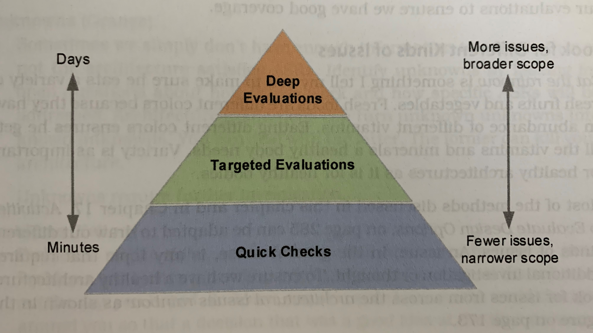

# Chapter 12 - [Evaluate] Give the Architecture a Report Card
Take the time to evaluate architecture, the feedback can be used to educate the team, create buy-in for design decisions, reduce delivery risks, and improve the architecture.
Think of architecture evaluations as making programming time more powerful rather than taking away programming time.

## Evaluate to Learn
> __Architecture evaluation__ is a process by which we learn the extent to which an architecture is fit for purpose.

Evaluations answer two questions:
_How good is the architecture?_
_How is the architecture good?_
To answer these questions, use architecturally significant requirements (ASRs).
The better the architecture satisfies the ASRs, the better it fits its purpose.

## Test the Design
Test the architecture early and test it often.
3 things are needed to evaluate an architecture:
- an artifact, a tangible representation of the design
- a rubric, a definition for _better_ or _worse_ from the stakeholders' perspective
- a plan for helping reviewers generate insights

### Make Something to Evaluate
Evaluate real things, not ideas.
This ties in closely to the tangible principle from _The 4 Principles of Design Thinking_.

### Define a Design Rubric
> A __design rubric__ defines the criteria reviewers should use when judging the fitness of the architecture.

A rubric consists of two parts:
- criteria describe the characteristics used to evaluate the design artifacts
- ratings describe the scale used to interpret the characteristics

Example design rubric

#### Select Criteria Based on ASRs
ASRs are helpful in defining a rubric for evaluation because:
- they define the software's purpose from a stakeholder's perspective
- they are defined in a precise, unambiguous, and measurable way (Chapter 5)

Desired qualities of a rubrics criteria:
- important and essential: exclude frivolous details and nice-to-haves
- distinct: within a rubric, criteria does not overlap
  - Each criterion is one facet of the overall fitness
  - Ideally, each criterion can be assessed and scored independently
- observable and measurable
- precise and unambiguous

Quality attribute scenarios should already meet these recommendations and always make for good criteria.

#### Decide the Rating Scale for Criteria
The size of rating scale depends on the goals of the evaluation.

| Scale Size | Examples | Use it when... |
| --- | --- | --- |
| 2 | yes or no; condition satisfied or not satisfied | Acceptance is all or nothing ofr a condition, standard, or presence of an item; single or few reviewers |
| 3 | fail, pass, or awesome; never, sometimes, or always; low, acceptable, or high | There is a minimum acceptable threshold but also a preferred expectation for the design; multiple reviewers are involved |
| 4 | never, sometimes, usually, or always; fail, fair, pass, or exceed | Detailed feedback is desired; expectations can be _nuanced_ or involve multiple pieces |
| 5+ | choose a number 1-10 | Avoid using. Too many options in the rating scale lead to inconsistent reviews |

### Generate Insights
Design rubrics contain answerable questions (criteria).
We find the answers by helping reviewers generate insights about the design, which reviewers use to form opinions about how well the design satisfies the ASRs.

To help decide which activities will help generate insights, figure out what info is required to answer the rubric.
Examples:
| Rubric Criteria | Insights to help score the criteria |
| --- | --- |
| Amount of Risk | Identify risks with risk storming or a general risk elicitation workshop; examine the number and severity of risks identified |
| Technical Debt | List value adding use cases that cannot be implemented with the current architecture; estimate the cost to prepare the architecture for the use case |
| Quality | Count the number of defects by architectural component and define a threshold for _high_ and _low_ quality |
| Fit for Problem | Walk through quality attribute scenarios and identify sensitivity points, problem areas, risks, and questions |

## Evaluate Early, Evaluate Often, Evaluate Continuously
There are multiple opportunities every day to confirm (or amend) design decision.

### Balance Cost and Value with the Evaluation Pyramid
The premise behind the _evaluation pyramid_ is similar to the test pyramid.

Example evaluations from the pyramid:
| Evaluation Type | How many? | Description | Examples |
| --- | --- | --- | --- |
| deep evaluation | 1-3 | considers the whole system and interplay of several ASRs | architecture trade-off analysis method |
| targeted evaluation | dozens | considers a single decision, component, or ASR | risk storming, question-comment-concern, architecture briefing |
| quick check | countless | considers discrete design decisions as they are made, often used to reinforce understanding or evaluate details | code review, story-telling, whiteboard jam, sanity check |

### Look for Different Kinds of Issues
> An __issue__ is any topic requiring additional investigation or though.

To ensure a healthy architecture, look for issues from across the _architectural issues rainbow_.

#### Risks (red)
As learned in _Let Risk Be Your Guide (Chapter 3)_, a risk is something bad that _might_ happen.
Risks can be mitigated or accepted.

#### Unknowns (orange)
Identify unknowns by looking for open questions about how things work and how specific ASRs will be addressed.
Unknowns require further investigation.

#### Problem (yellow)
Problems are bad things that have already happened, like tech debt.
Problems can be fixed or accepted.

#### Gaps in Understanding (green)
Gaps in understanding arise when what stakeholders think they know about the architecture does not match the current design.
Gaps in understanding can be addressed through education.

#### Architectural Erosion (blue)
The gap between the designed architecture and the actual architecture is called _architectural erosion/drift/rot_.
Without vigilance, the architecture drifts a little every day.
Architectural erosion can be addressed by paying attention to the small details - in code or documentation - on a regular basis.

#### Contextual Drift (violet)
_Contextual drift_ happens when the business drivers or context driving our decisions changes after we have made a design decision.
Contextual drift can be addressed by occasionally revisiting business goals, ASRs, and other things we think we know about our stakeholders and their needs.

### Start with Low Ceremony Evaluation Methods
High ceremony methods:
- filled with rituals and can be costly
- easy to repeat
- produce consistent results

Low ceremony methods:
- informal and have few rituals
- faster and cheaper, but narrower in scope
- more likely to produce inconsistent results

Low ceremony evaluation methods reinforce architectural thinking among the team and build a culture challenging design decisions.
As the team becomes comfortable with low ceremony approaches, strategically introduce targeted evaluations and, eventually, a deep evaluation.