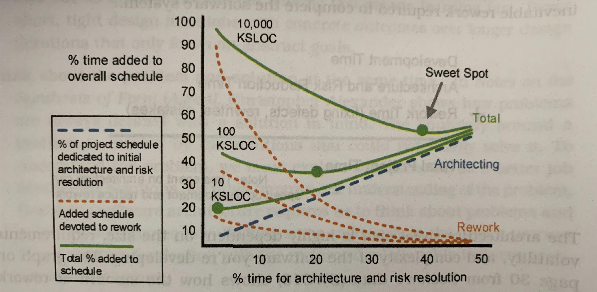

# Chapter 3 - Devise a Design Strategy
Design thinking emphasizes learning and experimentation; verifying pieces of the architecture incrementally as we design them.

This chapter teaches how to choose design mindsets as part of a broader design strategy by thinking about the risks in the software system.

## Find a Design that Satisfices
> __Bounded rationality__ describes the theoretical barrier created by limits in time, money, skills, and knowledge.

Bounded rationality complicates finding the perfect design for software architecture.
So, seek an architecture that satisfices.

> A __satisficing design__ is both satisfactory and sufficient - good enough - for our needs.

Look for a satisficing design by emphasizing the following activities:
- __treat solutions as experiments__: every potential solution is an experiment to be validated
- __focus on reducing risks__: if the architecture fails, everything fails.
Use risk to help decide what to design next.
- __work to simplify problems__: simple problems often have simple solutions
- __iterate quickly to learn quickly__: the faster we learn, the more we can explore, and the greater confidence we will have in our solutions.
Favor short, tight design iterations with concrete outcomes over longer design iterations focusing only on abstract goals.
- __think about the problem and solution simultaneously__: there is a reciprocal relationship between problems and solutions.
To understand the problem, explore solutions. To better explore solutions, improve understanding of the problem.

## Decide How Much to Design Up Front
A design strategy involves deciding how much of the architecture to design up front and how much to allow to emerge over time.
The design strategy communicates how we want to grow the architecture.

### Find the Design Sweet Spot
> The __design sweet spot__ is the optimal amount of time to spend designing architecture before diving into implementation.

To find the sweet spot, account for both design costs and the inevitable rework required to complete the software system.
```
  dev time
+ architecture and risk reduction
+ rework time (fixing defects, rewrites, mistakes)
-----------------
  total project time
```

The architecture sweet spot is highly dependent on the size, requirements volatility, and complexity.
If you anticipate a high degree of change to architecturally significant requirements, delay making binding decisions and focus on writing lighter-weight design and documentation methods.

Here is an example graph of the design sweet spot based on size (KSLOC is 1,000 source lines of code)


<br>
<br>
Knowing how much time to spend on architecture design does not indicate when to do the design work or when to adopt the different mindsets.
Use risk to decide when to foucs on architecture.

## Let Risk be your Guide
Risk is an excellent indicator of what might prevent success.

### Identify Conditions and Consequences
> A __risk__ is something bad that might happen in the future.

But don't speculate (what if...), use the architecture today to help decide what to design next.
A risk consists of two parts: condition; consequence.
- > the __condition__ is a fact currently true
- > the __consequence__ is something bad that might happen in the future as a direct result of the condition

Ways to reduce or remove risk:
- reduce the probability
- reduce the impact
- push out the time frame of the risk
- remove the condition
- accept it and do nothing; deal with the repurcussions if the risk converts into an actual problem

Knowing both the condition and the consequence creates hooks for deciding what to do about the risk

### Use Risk to Choose a Design Mindset
Software architecture design is an exercise in risk reduction.

When you have a bad feeling, picak a condition and consequence capturing the essence of your bad feeling, then use the risk to guide design activities.

Engineering risks helps us decide what to design.
Design mindsets help us devise a design strategy to decrease the risk.
If a risk must be reduced (cannot accept and do nothing):
1. which parts of the risk can be addressed - condition, impact, probability, or time frame
2. choose a design mindset.
Here are questions to decide which mindset is appropriate

| Try | If... |
| --- | --- |
| Understand | The risk is about the problem. Do you need a deeper understanding of stakeholders or other system actors? |
| Explore | The risk is about the solution. Have you seen enough solution alternatives? |
| Make | The risk is about communication. Do stakeholders fully understand design concepts at play and can they see the architecture? |
| Evaluate | The risk involves a design decision or the design's overall fit. Do we need to make a design decision? |

### Shift to Passive Design Once Risks are Reduced
Architects should work to reduce technical risks to the point where architecture is no longer the biggest source of risk in the system.
Once true, shift from _active design_ to _passive design_.
With active design, drive the design process in the pursuit of reducing risk.
With passive design, observe the architecture as it manifests in the working system and take corrective action as necessary.

Passive design still requires many architect responsibilities such as documentation, preventing architecture drift, teaching, etc.

## Create a Design Plan
Design plans outline the general strategy for how the team will spend their time on architecture.

Capture your plan in a lightweight document such as an inception deck.
Every design plan should include (this is not exhaustive; also refer to the book for more info):
- stopping conditions for design
- required design artifacts
- time line
- top risks
- notional architecture design