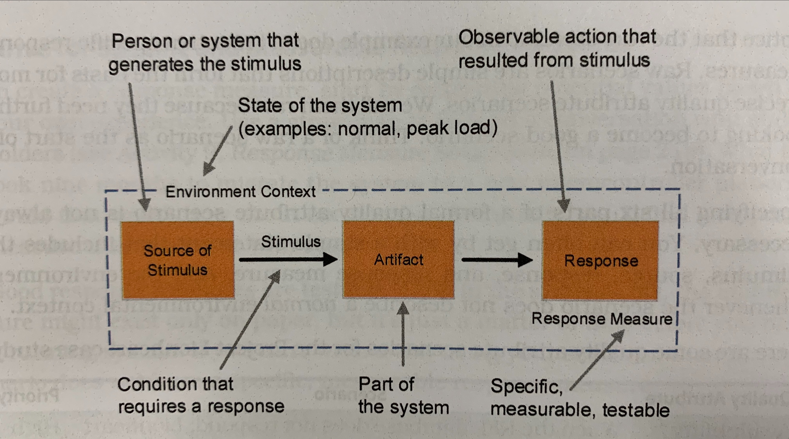

# Chapter 5 - [Understand] Dig for Architecturally Significant Requirements
> An __architecturally significant requirement (ASR)__ is any requirement strongly influencing the choices of structures for the architecture.

There are four categories of ASRs:
- constraints: unchangeable design decisions, usually given, sometimes chosen
- quality attributes: externally visible properties characterizing how the system operates in a specific context
- influential functional requirements: features and functions requiring special attention in the architecture
- other influencers: time, knowledge, experiences, skills, biases, and all the other stuff swaying decision making

## Limit Design Options with Constraints
All constraints limit choice, but well-chosen constraints simplify the problem and can make it easier to design a satisficing architecture.

Constraints can influence business or technical concerns.
Business constraints limit decisions about people, process, costs, and schedule.
Technical constraints limit decisions about the technology we may use in the software system.

### Capture Constraints as Simple Statements
To capture a constraint, describe the decision and its origin in a brief statement.

Constraints, once decided, are 100% non-negotiable.
Be conservative in accepting constraints.
There is a huge difference between _this must be done or fail_ and _this should be done unless you have a good reason not to do it_.

As time goes on, it is easy for design decisions to become constraint-like.
Therefore, be careful to distinguish the constraints chosen for you from the constraints you give or make yourself.
There is always the option of changing a constraining design decision.

## Define the Quality Attributes
Quality attributes define how well a system should perform some action within a specific context.

Common Quality Attributes:
| Design Time Properties | Runtime Properties | Conceptual Properties |
| --- | --- | --- |
| Modifiability | Availability | Manageability |
| Maintainability | Reliability | Supportability |
| Reusability | Performance | Simplicity |
| Testability | Scalability | Teachability |
| Buildability or Time-to-Market | Security | |

<br>
Every architecture decision promotes or inhibits at least one quality attribute.
Many design decisions promote one set of quality attributes while inhibiting others that are also important!
When this happens, we'll trade one quality attribute for another by choosing a structure for the architecture favoring one quality attribute but harming others.

### Capture Quality Attributes as Scenarios
Use a __quality attribute scenario__ to provide an unambiguous description of a quality attribute.

Quality attribute scenarios describe how the software system is expected to operate within a certain environmental context.
Unlike functional requirements, quality attribute scenarios qualify the response using a response measure; it is not enough to respond, how the system responds is also important.

There are 6 parts of a quality attribute scenario:

- stimulus: an event requiring the system to respond in some way; kicks off the scenario
- source: the person or system initiating the stimulus
- artifact: the part of the system (whole system or specific component) whose behavior is characterized in the scenario
- response: an externally visible action taking place in the artifact as a result of the stimulus
- response measure: defines the success criteria for the scenario; specific and measurable
- environment context: describes the operational circumstances surrounding the system during the scenario; examples are normal, peak, load

It is not always necessary to specify all 6 parts of a formal quality attribute scenario.
Often, a simple statement including the stimulus, source, response, and response measure are enough.

Characteristics of a great quality attribute scenario:
- communicates the intent
- precise, measurable,
- unambiguous

## Look for Classes of Functional Requirements
All functional requirements are essential to the success of the software system, but not all have architectural significance.
When a functional requirement drives architecture decision making, it is an __influential functional requirement__.

How to identify influential functional requirements:
1. start with a notional architecture summarizing your current thinking about the architecture
2. identify general classes of requirements representing the same type of architectural problem
3. for each problem class identified, walk through the notional architecture and show how to achieve each requirement group. If not immediately obvious how to implement the feature based on the known coarse-grained requirements, it might have architectural significance.

Here are a few strategies for step 2:
- look for functional requirements implementable within the same architectural elements; for example, persistence or user-interaction
- look for high-value, high-priority functional requirements
- look for functional requirements that seem difficult to implement

Reference any influential functional requirements in the architecture documentation.
The goal is to call attention to critical features influencing decision making.

## Find Out What Else Influences the Architecture
In addition to ASRs, many other factors will affect the architecture.
It is impossible to predict and document all these prior to making design decisions, so these are usually only recorded as part of the rationale for design decisions.

## Dig for the Information You Need
Architecturally significant requirements are hidden all around us.
They are in user stories, implied in requests, hinted at by stakeholders, etc.
Dig for this information.

## Build an ASR Workbook
Record ASRs in an ASR Workbook.
At the beginning of a new system, the ASR Workbook is living and changes rapidly.
As the architecture coalesces, the workbook is edited less frequently but referenced more often.
Although other artifacts could eventually supplant portions of the ASR Workbook as a source of truth, it remains an important historical record.

The ASR Workbook provides context and information for many.
The more people who understand the ASRs, the less architectural oversight required.
Use the ASR Workbook to introduce architectural concepts to your team and stakeholders.

Here is a sample ASR Workbook outline.
Use it as a checklist for planning requirements elicitation.
```
Purpose and Scope
Intended Audience
Business Context
    Stakeholders
    Business Goals
Architecturally Significant Requirements
    Technical Constraints
    Business Constraints
    Quality Attribute Requirements
        Top Scenarios
    Influential Functional Requirements
        Top Users or User Personas
        Use Cases or User Stories
Appendix A: Glossary
Appendix B: Quality Attributes Taxonomy
```