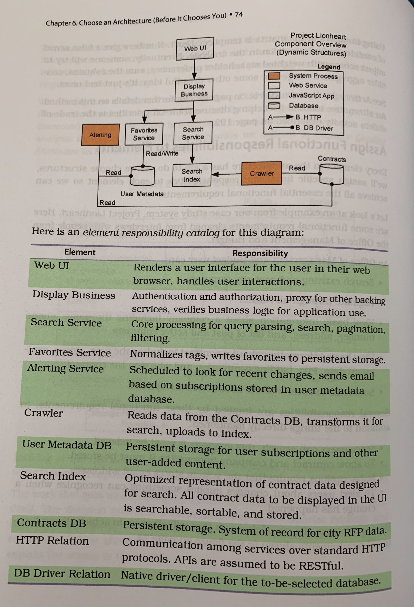

# Chapter 6 - [Explore] Choose an Architecture (Before it Chooses You)
Designing software architecture is all about making decisions under uncertainty.
Let's learn how to choose structures for the architecture by using architecurally significant requirements (ASRs) to drive decision making.

## Diverge to See Options, Converge to Decide
Design exploration is an iterative journey of divergence and convergence.
1. identify a problem
2. diverge thinking and generate design alternatives that can solve the problem
3. converge thinking by building consensus and eliminating options

### Explore the Architecturally Significant Things
Here are some typical areas of a software system's design to explore:
- explore elements and their responsibilities to determine the general compostion of structures in the architecture
- explore relations and their interfaces to determine how elements interact with one another
- explore the domain to understand the world the architecture models
- explore technology and frameworks to bootstrap promoting quality attributes
- explore construction and deployment methods to ensure the architecture can be shipped
- explore past designs to gain perspective and guide decision making

To create a clear connection between design decisions and stakeholders' needs, use the categories of ASRs from chapter 5 to organize the approach to exploration and decision making.

## Accept Constraints
Although you have to accept constraints, their impact on the architecture is not always evident.
Consider and explore architectural decisions satisfying the constraint.

## Promote Desired Quality Attributes
Choose structures promoting quality attributes.
The most common way to select structures is by exploring patterns (chapter 7 has some patterns to explore).
Remember, all design is redesign.

With quality attributes, there is rarely a single _right_ or _wrong_ design, only designs _better_ or _worse_ relative to desired system properties.
Therefore, to make a decision some analysis is needed.

### Create a Decision Matrix
> The __decision matrix__ is a tool for summarizing the trade-off analysis among architecture design options.

The idea is to create a visual representation showing how each option influences valuable properties.
It can be used for making decisions about any architectural choice from patterns to functional responsibilities to tech choice.

Here is an example scale for summarizing the analysis of each architecture design option:
| | |
| --- | --- |
| strongly promotes | the design option actively helps you to achieve the system property |
| promotes | the design option allows you to achieve the system property |
| neutral | the design option neither helps nor hurts the system property |
| inhibits | the design option makes achieving the system property slightly more difficult |
| strongly inhibits | the design option makes it costly or significantly difficult to achieve the system property |

Although tempting, do NOT use numbers in the matrix.
Numbers give a false sense of confidence and precision in the analysis.

## Assign Functional Responsibilities to Elements
Every element in the architecture has a job to do.
When choosing structures, assign specific functional responsibilities to each element.

Here is an example component overview diagram and element responsibility catalog:

The __element responsibility catalog__ describes the essential duties each element in the architecture has the authority to perform.
Influential functional requirements make for a great checklist when assigning responsibilities to elements.

## Design for Change
This chapter has taught how to explore options and make decisions using your understanding of the ASRs.
This is important, but you must also account for change.
Design for change by choosing when to make a decision and by moving design decisions out of the architecture.

### Defer Binding Decisions until the Most Responsible Moment
Recall, an architectural decision is not easily reversed.
One strategy for avoiding dead ends and wrong turns is to defer making binding decisions for as long as responsible.
Delaying design decisions until they must be decided creates time for research and exploration.

How do we know when the decision must be made?
The _least responsible moment_ is when a decision must be made to avoid losing important design alternatives.
The _most responsible moment_ is when a design decision has the greatest positive impact on the software system.
Ideally, these two moments are at the same time.
Make design decisions at the most responsible moment, which is often earlier than we think.

Here are some questions to help decide whether now is the right time to make a design decision:
- does a lack of a decision prevent forward progress?
- does the decision resolve a problem that cannot wait?
- does the decision create more options or new opportunities?
- does delaying the decision introduce significantly more risk?
- do I understand and accept the implications of the decision?
- do I have a clear rationale for why I am making this decision now?
- do I have the time to undo this decision if it is wrong? Can I afford to make a mistake?

Identifying the most responsible moment to decide does not mean you have enough information to make a good decision.
Move things likely to change out of the architecture.

### Move Design Decisions Out of the Architecture
If a design decision is easy to change later, then it is no longer an architectural concern.
When possible, design the architecture so decisions likely to change are left open for downstream designers to decide.

There are many ways to move design decisions out of the architecture.
Examples: use SOLID at an architecture level, pluggable architectures, external configuration, self-describing data, and dynamic discovery.

The key: alter the system's behavior at design time or runtime without modifying the architecture and, ideally, without adversely affecting essential quality attributes.