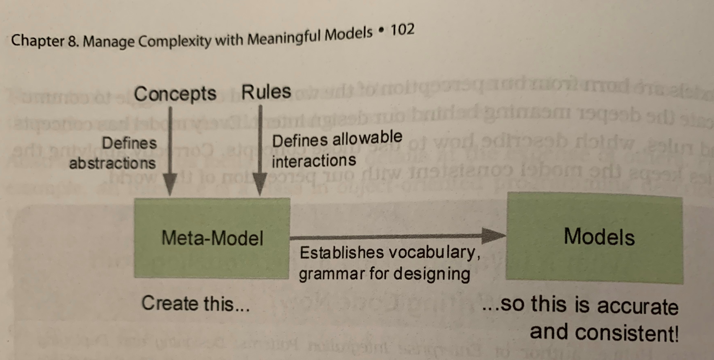
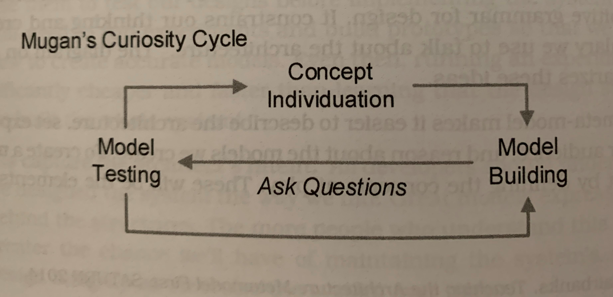

# Chapter 8 - [Make] Manage Complexity with Meaningful Models
Complexity is an inevitable by-product of every successful software system.
Without constant vigilance, software systems eventually become victims of their own success.

In Chapter 1, we learned architecture is made up of structures, which in turn are composed of elements and relations.
Now we will learn how to use these basic building blocks to create meaningful models helping us reason about our designs.

## Reason About the Architecture
Collaboration with other humans is a way of turning problem solving into a massively parallel operation.
An abstraction is a concept representing chunks of knowledge.
These tools - collaboration and abstraction - provide what is needed to think through, analyze, and understand our architectures.
These tools enable useful models.

> A __model__ is a precise and accurate description of some piece of the architecture enhancing communication and can be used to reason about the system.

A good architecture model has many benefits:
- establishing the ubiquitous language
- directing attention to interesting details: focuses on the right details at the right time to answer a specific question
- enabling reasoning about quality attributes and other system properties:
  - making it easier to think about and describe how the system would behave
  - the right models can even help test designs before implementing the system
- capturing the architect's intent

Models are born from our perception of the work and _our struggle to communicate the deeper meaning_ behind our design intent.

## Design the Meta-Model
> A software system's __architectural meta-model__ defines the concepts used in a model and the rules for how those concepts are applied.

Defining a meta-model makes it easier to describe the architecture, set expectations for the audience, and reason about the models we create.
The concepts are the elements and relations in the architecture.

### Individuate New Concepts
> __Concept individuation__ is the cognitive process by which we recognize ideas as being distinct from one another. As we individuate new ideas in the architecture, we update our understanding and the models representing it.

The __curiosity cycle__ helps individuate concepts.
First, ask a question.
Through a test, we will either find the answer in our model or find a gap in our current understanding.
If we find an answer, then we reinforce the existing model.
When finding a gap, we must figure out how to change our model to fill it.

The curiosity cycle also applies to creating rules.

What if we lack the knowledge or experience necessary to individuate concepts required to design the right system?
Starting with an existing meta-model, such as an architecture pattern, can reduce the risk.

### Use Good Names
Naming is a design tool.
The names we choose reflect how well we understand what we're designing.
As understanding improves, so too do the names given to the concepts.
Here are Belshee's 7 Stages of Naming:
1. missing - no name because we don't know enough about the system or concept to extract a named element
2. nonsense - name has no meaning; a chunk of ideas has been identified as somehow related
3. honest - describes at least one of the element's responsibilities
4. honest and complete - describes all of the element's responsibilities
5. does the right thing - reflects a purposeful decision to evolve the element's responsibility; this happens as knowledge is gained about the element's role in the context of the architecture
6. intent - describes the element's responsibility but also its purpose; this requires understanding _why_ the element exists in addition to what it does
7. domain abstraction - transcends individual elements to create a new abstraction; this is where new concepts for the meta-model are born

## Build Models into the Code
Although models enable reasoning about the architecture, it is not enough.
We must make the architecture self-evident within the code to ease maintaining conceptual design integrity and promoting desired quality attributes.
Building models into the code decreases the chances of architectural architectural drift since the models and code evolve together.

Unfortunately, it is impossible to directly realize all design concepts from the architecture's conceptual meta-model in code; this is the _model-code gap_.
To shrink this gap, use an _architecturally evident coding style_ by embedding hints about our models, their rules for use, and the rationale behind the design into the code.

How?
- apply the vocabulary of the architecture (ubiquitous language)
- embed the domain model into the code (DDD)
- organize code to make patterns obvious
- enforce relations among elements; make it virtually impossible to violate the architecture
- add hints as comments