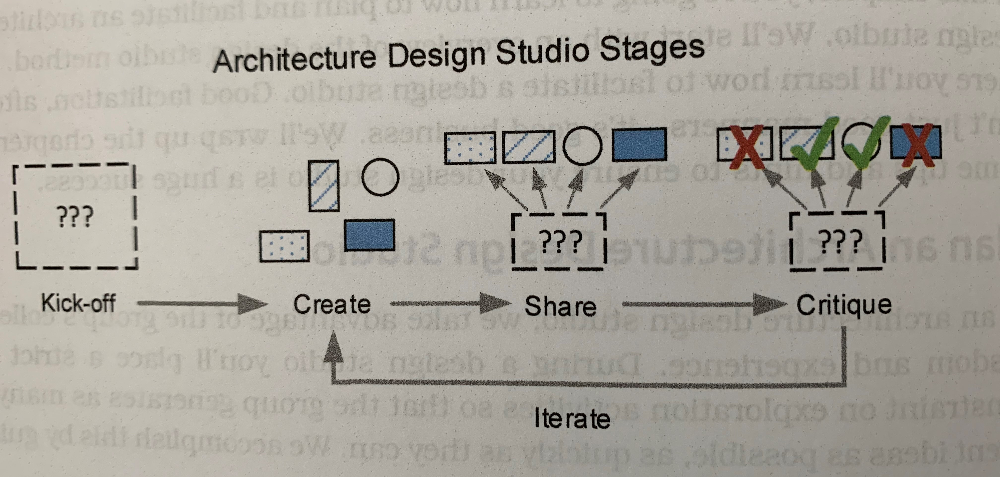

# Chapter 9 - [Explore, Evaluate, Make] Host an Architecture Design Studio
A _design studio_ encourages group collaboration and has strict time constraints to help the team see a broad range of ideas in a short time frame.
It is inspired by the idea that more time does not necessarily lead to better designs.
A design studio creates buy-in for design decisions and improves team communications by engaging everyone in designing the architecture.

## Plan an Architecture Design Studio
A design studio should be fast, fun, and effective.
To be effective, it must result in a strong set of actionable ideas:
- ideas for things to make: for promising ideas, flesh out details by making models or prototypes
- ideas needing more research: these ideas seem right but consist of broad assumptions or miss important info, thus requiring further investigation
- ideas opening new questions: its better to have these questions now than later; take them back to stakeholders to improve understanding of the problem

All design studio workshops follow the same basic structure:
1. prepare: do research to understand the problem you are going to explore
2. kick-off: describe the workshop goals and problem context to the group
3. create: model, sketch, prototype. usually time-boxed
4. share: present creations to the group and describe specifically how your design achieves the goals
5. critique: the group provides feedback relative to how well they think the design satisfies the goals
6. iterate: repeat steps 3-5; _plan to iterate at least 3x for each set of goals you are exploring_
7. follow-up: decide next steps for the most promising ideas, risks, or questions

### Before the Workshop: Prepare
The goal of this stage is to choose goals and decide who to invite.
This could take days or weeks.
You should at least have draft business goals and architecturally significant requirements before starting.
You should understand enough of the problem and context to articulate useful workshop goals; it is ok if you only partially understand the problem before starting the workshop.

### Kick off the Workshop
Set the stage for successful collaboration.
Review the context and outline the workshop goals.

### Iterate through the Create-Share-Critique Cycle
Each iteration through the cycle explores more of the design space and improves the group's understanding of what is possible.
Specific activities usable in this cycle are in Choose Appropriate Design Activities.

#### Create
Value ideas, not perfection.
Thus, keep the modeling and sketching of design ideas to an analog format.
Time box.
Participants work alone or in small groups.

#### Share/Pitch
Each idea is pitched in a 3-5 minute window.
Groups should describe how their design satisfies the goal by hitting the main points, this is not a full briefing.
Others listen and may __not__ ask questions.

#### Critique
Now, other participants critique an idea.
Feedback should focus on the merits of the design relative to the workshop's goals.

| Do this | Avoid This |
| --- | --- |
| focus on the goals the designers said they addressed | get defensive about your design |
| be specific; focus on facts | share personal opinions - "I like X, it's my fave" |
| ask clarifying questions | get sidetracked by problem solving |
| point out risks and new problems introduced by the design | be a jerk (your turn is next!) |
| point out benefits about the design | focus only on downsides |

### Iterate
Iteration allows participants to build on what they collectively learn.
With each iteration of the create-share-critique cycle, tweak the group dynamics to encourage broader exploration while simultaneously building a sense of shared ownership.

### Close the Design Studio and Decide on Follow-up Actions
Reflect on emergent themes and discuss general observations as a group.
Decide on specific action items.
Take pictures of the produced materials, create write-ups in a shared repo, assign action items.

## Choose Appropriate Design Activities
As the design studio host, choose activities that guide everyone through the create-share-critique cycle in a fast, effective, and fun way.
Try to select activities that are architecturally focused and effective when thinking about the system as a whole.

## Invite the Right Participants
The quality of the workshop is determined by the participants.
The host must balance two variables: size and diversity.

Effective collaboration breaks down in groups larger than about 7.
While creating subgroups is an option, a single facilitator can realistically handle only 3 or 4 subgroups at a time.
Limit the size of an architecture design studio to about 10 people max.

In addition to essential stakeholders, include others with a different background or a fresh perspective; this creates opportunities for eureka moments.

Although all design is social, beware of _group think_.
This is where the group loses its individuality and worries more about harmony and consensus than satisfying the goals of the workshop.
Discussions lacking in disagreement does not imply positive progress; conflict defines the boundaries of exploration and highlights important concepts.

| If the group... | It might mean... |
| --- | --- |
| asks questions to clarify meaning, politely challenges ideas, and discusses implications of an idea | everyone is collaborating well |
| goes along with whatever seems to be the prevailing idea; hesitates to share their thoughts | potential fear of conflict or lack of confidence in collaborating |
| does not share a wide range of ideas; acts as an echo chamber; comes back to the same themes | the group didn't diverge their thinking widely enough |
| always lets the same people do the talking | not everyone understands the discussion; dominant personalities are overwhelming quieter individuals |

## Manage the Group
In addition to making the agenda and keeping time, the facilitator ensures the workshop produces useful outcomes.
To help do so:
- allow enough time for the workshop
- set expectations and ground rules from the start
- introduce activities with the tell-show-tell approach
- share tips for activities
- set deadlines (time-box)
- educates participants JIT
- use parking lots

## Work with Remote Teams
Tips for facilitating a remote workshop, or any activity:
- add additional time to the agenda
- create breakout opportunities
- provide a focal point
- some activities can be done offline